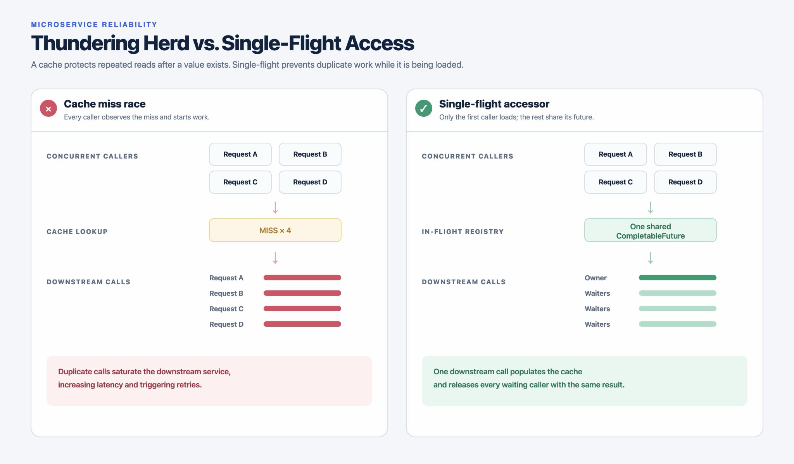

# Thundering Herd Experience and How a Single-Flight Accessor Saved Us

One day, one of our microservices started burning down.

CPU climbed to 100%, latency increased, and downstream services began to feel the pressure. We scaled out the affected service as an emergency mitigation. It worked well enough to stabilize the system, so we continued with the rest of the incident response.

Then the same incident happened again—at a different time and with no obvious change in the business traffic. That was the clue: scaling was treating the symptom, but something in our access pattern was creating traffic that should not have existed.



## The investigation

We traced the calls between services and found many requests asking the downstream service for the same data at almost exactly the same time.

At first, this was confusing. We already had a cache between the services. A cache miss should cause one refresh, followed by cache hits for the other callers—right?

Not necessarily.

The problem was not the cache itself. The problem was the gap between detecting a cache miss and storing the refreshed value.

## The cache-miss race

Our original access pattern was conceptually similar to this:

```java
@Cacheable(cacheNames = "product", key = "#productId")
public Product getProduct(String productId) {
    return productClient.fetchProduct(productId);
}
```

When the value was already cached, this was efficient. But when the value was missing, multiple concurrent callers could all observe the same miss before any one of them had populated the cache:

```text
Request A ── cache miss ──> downstream call
Request B ── cache miss ──> downstream call
Request C ── cache miss ──> downstream call
Request D ── cache miss ──> downstream call
```

Each request was valid in isolation. Together, they created a thundering herd: a group of callers rushing to perform the same expensive operation.

The cache was populated only after the downstream call completed. By then, the downstream service had already received several duplicate requests.

> `@Cacheable` is a cache abstraction; it does not automatically guarantee request coalescing for concurrent cache misses. The exact behavior also depends on the cache provider and configuration.

## Why the incident amplified

The first duplicate request was not the real danger. The danger came from the feedback loop:

1. A hot key was missing or expired in the cache.
2. Many requests arrived concurrently for that key.
3. Each request started its own downstream call.
4. The downstream service became saturated.
5. Latency and timeouts increased.
6. Retries created even more concurrent calls.

Scaling out the caller service could even multiply the pressure. Every instance had an opportunity to issue its own duplicate request.

## The fix: single-flight access

We introduced a single-flight accessor around the downstream call.

The rule is simple:

> For a given key, allow only one downstream request to be in progress. Every concurrent caller shares the same `CompletableFuture`.

The first caller creates and owns the downstream operation. Later callers find the existing future and wait for that same result. Once the call completes, the result is written to the cache and the future is removed from the in-flight registry.

```text
Request A ── creates future ──> one downstream call
Request B ── shares future ───┐
Request C ── shares future ───┤
Request D ── shares future ───┘
```

## Java implementation

Here is a simplified implementation using `ConcurrentHashMap` and `CompletableFuture`:

```java
public class SingleFlightProductAccessor {

    private final ProductClient productClient;
    private final Cache<String, Product> cache;

    private final ConcurrentHashMap<String, CompletableFuture<Product>> inFlight =
            new ConcurrentHashMap<>();

    public SingleFlightProductAccessor(
            ProductClient productClient,
            Cache<String, Product> cache) {
        this.productClient = productClient;
        this.cache = cache;
    }

    public CompletableFuture<Product> getProduct(String productId) {
        Product cachedProduct = cache.getIfPresent(productId);

        if (cachedProduct != null) {
            return CompletableFuture.completedFuture(cachedProduct);
        }

        CompletableFuture<Product> newFuture = new CompletableFuture<>();
        CompletableFuture<Product> existingFuture =
                inFlight.putIfAbsent(productId, newFuture);

        if (existingFuture != null) {
            return existingFuture;
        }

        loadProduct(productId, newFuture);
        return newFuture;
    }

    private void loadProduct(
            String productId,
            CompletableFuture<Product> future) {

        productClient.fetchProductAsync(productId)
                .whenComplete((product, error) -> {
                    try {
                        if (error != null) {
                            future.completeExceptionally(error);
                            return;
                        }

                        cache.put(productId, product);
                        future.complete(product);
                    } finally {
                        inFlight.remove(productId, future);
                    }
                });
    }
}
```

The important operation is:

```java
inFlight.putIfAbsent(productId, newFuture);
```

`putIfAbsent` is atomic. Only one caller can register a new future for a key. Every other caller receives the future that is already registered:

```java
if (existingFuture != null) {
    return existingFuture;
}
```

This turns many concurrent downstream calls into one shared operation.

## Failure handling matters

Single-flight coordination is only safe when failure paths are handled deliberately.

The owner must complete the shared future exceptionally when the downstream call fails:

```java
future.completeExceptionally(error);
```

Otherwise, every waiting caller can remain blocked indefinitely.

The in-flight entry must also be removed after both success and failure:

```java
finally {
    inFlight.remove(productId, future);
}
```

The conditional remove is intentional. It removes the entry only if the map still contains the same future created by this load. That prevents an older request from accidentally removing a newer request that has already started for the same key.

## One important limitation

This implementation coordinates requests inside one service instance. With three replicas, each replica has its own in-memory in-flight map:

```text
Instance 1 ── one downstream call
Instance 2 ── one downstream call
Instance 3 ── one downstream call
```

That is still a significant improvement over hundreds of duplicate calls, but it is not globally single-flight.

If cross-instance coordination is required, the design may need a distributed lock, Redis-based coordination, a shared cache with atomic loading, or another request-coalescing mechanism. Those options add their own failure modes—lock expiry, owner failure, network partitions, and recovery behavior—so local single-flight is often the smallest effective fix.

## What changed

After introducing the accessor, a cache miss no longer meant that every concurrent caller could independently refresh the value. It meant that one caller performed the refresh while the others shared its in-progress result.

The downstream service saw fewer duplicate calls, the caller service stopped amplifying cache misses into traffic spikes, and the cache became a more reliable part of the protection strategy.

The lesson was not simply “add a cache.” It was to understand the entire access pattern around the cache:

> What happens when many requests miss the cache at the same time?

## Key takeaways

- A cache does not automatically prevent duplicate work during a concurrent cache miss.
- `@Cacheable` should not be assumed to provide request coalescing unless the cache provider and configuration explicitly guarantee it.
- The thundering herd problem can turn one cache miss into a downstream traffic spike.
- A single-flight accessor allows only one load per key while sharing the result with concurrent callers.
- `CompletableFuture` provides a natural representation of the shared in-progress operation.
- Complete the shared future on both success and failure.
- Remove in-flight entries after completion to prevent leaks and permanently stuck requests.
- Conditional removal protects newer loads from older requests.
- An in-memory registry coordinates only within one service instance.
- Scaling out may reduce local CPU pressure, but it does not fix duplicate access by itself.
